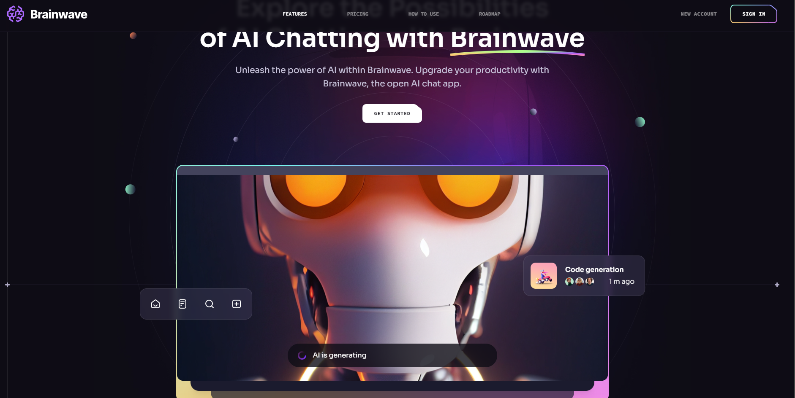
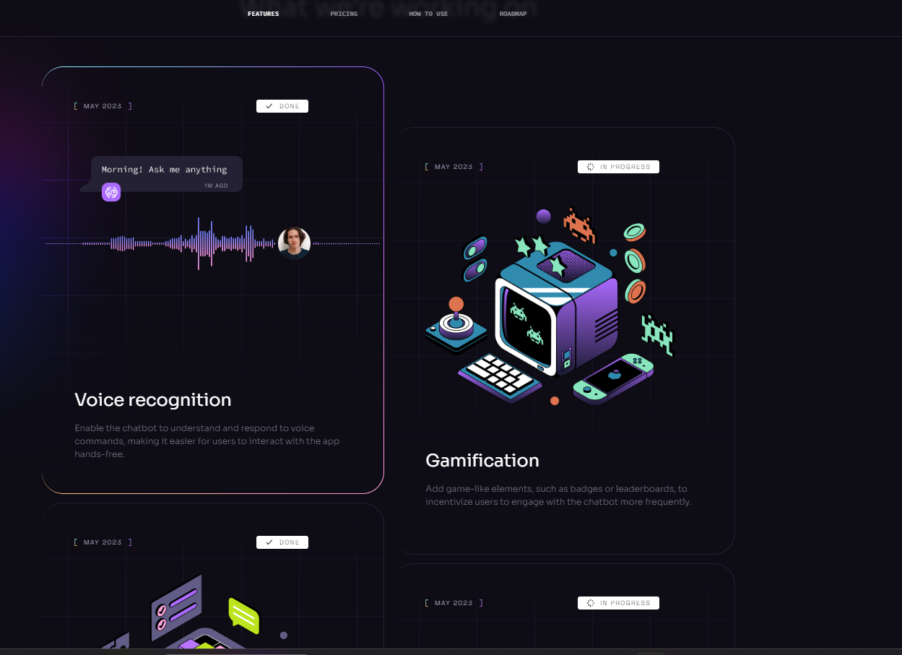

AI Chatbot SaaS Website Demo
This project is a fully responsive website demo for an imaginary AI chatbot company, showcasing the capabilities of modern web development tools like React, Vite, and Tailwind CSS. The demo presents a clean and intuitive interface, perfect for promoting AI-based chatbot services.

Features

Fully Responsive Design: Adapts seamlessly to all devices (mobile, tablet, desktop).
Modern AI Interface: Sleek and professional design tailored for an AI chatbot company.
Fast Development with Vite: Utilizes Vite for fast build times and optimized performance.
Interactive UI with React: The website provides dynamic and engaging user interactions, leveraging React’s powerful component-based architecture.
Tailwind CSS Styling: Ensures a responsive and customizable UI with minimal effort.

Technologies Used

Frontend Framework: React (with functional components and hooks)
Build Tool: Vite (for fast development and bundling)
Styling: Tailwind CSS (for responsive and utility-first design)
JavaScript: ES6+ (modern JavaScript)

Getting Started

To run this project locally, follow these steps:

Prerequisites
Node.js installed (version 14 or higher)
Git installed
Installation
Clone the repository:

git clone .....
Navigate to the project directory:

cd your-repository
Install the dependencies:

npm install
Run the development server:

npm run dev
Open your browser and navigate to http://localhost:3000 to view the website.

## Screenshots

Demo Link
You can view the live demo of this project [here](https://ai-chatbot-by-aman.vercel.app/).
